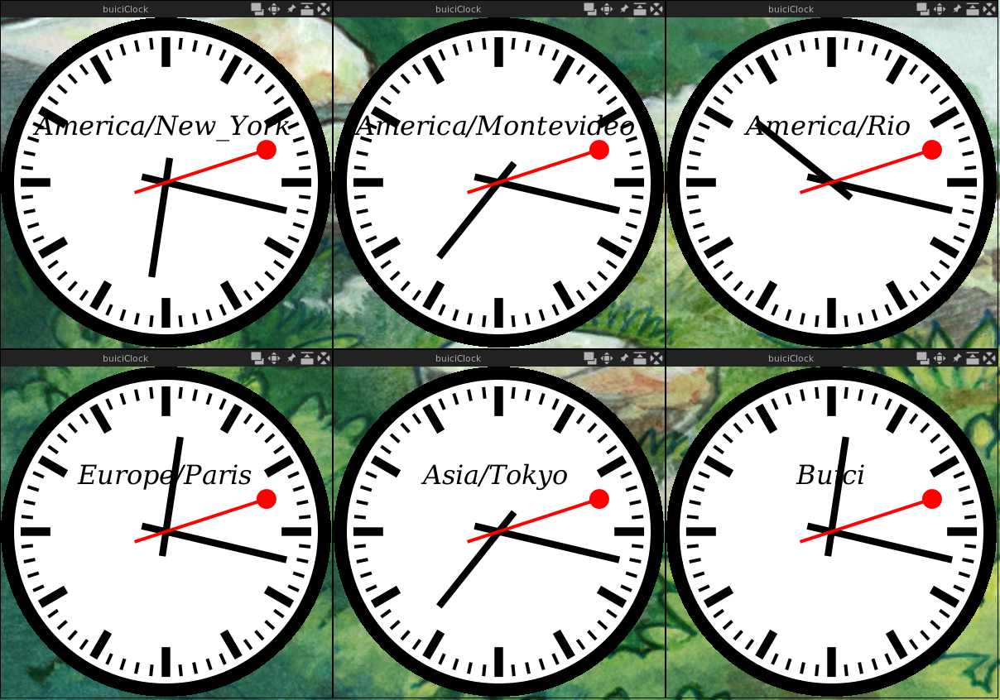

# buici-clock

This is a wip hacking repository based on the buici-clock software
originally wrote by Marc Singer : https://launchpad.net/ubuntu/+source/buici-clock/0.4.9.4

Improvements:

 * Add timezone switch to display a specific country time (-tz)
 * when tz is speccified, use the text as label (replace 'Buici')

